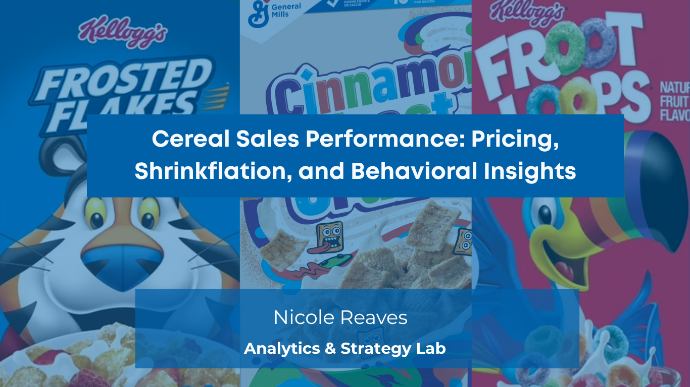

# Cereal Sales Performance – Executive Business Intelligence Report: Portfolio Summary Review
[View Full PowerBI Report Here](/Cereal_Sales_Power_BI_Report/Cereal_Sales_Performance_Inflattion_Pricing_Consumer_Loyalty_Insights.pdf)
[View Cereal Sales Performance Insights Report Here](/Cereal_Sales_Insights_Report.md)

>  **Looking for the strategic rationale behind this analysis?**  
> Explore the companion documents:  
> 🔗 [Behavioral Spotlights](/Behavioral_Spotlight)
> 🔗 [Cereal Sales Insights](/Insights/insights)
> 🔗 [Strategic Recommendations](/Strategic_Recommendations)

---

## Project Theme and Scope

**Harvest View CPG** and the **Retail Intelligence Alliance (RIA)** partnered in a simulated industry engagement to analyze consumer behavior, pricing psychology, and promotional effectiveness across the U.S. cold cereal market (2020–2025). This report delivers strategic intelligence to:

- **Harvest View**: Improve brand pricing strategies, shrinkflation communication, and consumer retention
- **RIA**: Strengthen retailer pricing, margin forecasting, and perception vs. reality strategy

---

## Executive Summary

This analysis explores cereal sales performance between 2020–2025, uncovering how inflation, price sensitivity, and shifting consumer loyalty have impacted brand performance and retailer dynamics.

Key insights include:

- A **13% decline in brand loyalty** during peak inflation periods (2022–2023)
- A **projected 8% drop in unit sales** tied to AI-forecasted price increases
- And, based on segmentation analysis, **“No Promotion” sales outperformed both 10% Off/Clearance by 11% and BOGO offers by 6%** in total revenue contribution

These patterns highlight the nuanced relationship between consumer psychology, perceived value, and discount strategy. Leveraging behavioral economics, Power BI Key Influencers, and custom loyalty metrics, this report offers actionable recommendations for optimizing pricing strategies and sustaining market share in a volatile economic climate.

**Methodology Note:**
> All data transformations, metrics, and visualizations were developed manually through DAX modeling, iterative design, and structured exploratory analysis. The only AI-assisted element was Power BI’s Key Influencers visual, and it was selectively used to validate observed patterns. It served as a complementary tool, not a driver of insight. This report reflects end-to-end analytical ownership, visualization design choices, strategic interpretation, and a deep commitment to methodological transparency and integrity.

---

## What Stakeholders Gain

- **Executives**: CPG and Retailer-level pricing recommendations backed by loyalty and inflation models  
- **BI Leaders**: Behavioral economic insight applied to price perception and SKU-level loyalty  
- **Technical Recruiters, Hiring Managers, Functional Partners and Team Colleagues**: Strategic reasoning, segmentation design, and actionable forecasting embedded in reporting

---

## Introduction

This report presents a simulated, full-scale BI engagement that transforms complex cereal market behavior into a rich decision-support framework. Designed in Power BI, it includes over **21 visual narratives**, interactive slicers, and DAX-powered metrics.

---

## Business Problem

As inflation accelerates and shrinkflation reduces perceived value, brands and retailers face three major risks:

- **Losing price trust** with consumers through silent price hikes
- **Eroding margin** through overly generous or poorly timed promotions
- **Misjudging loyalty** by treating brand-switching as disloyalty instead of price sensitivity

---

## Business Questions

- Which brands maintained loyalty despite pricing shifts?
- How do promotions (e.g., BOGO, 10% Off, Clearance) affect sales behavior?
- Where does consumer perception diverge from actual price?
- Which retailers exhibit the highest price volatility or margin risk?
- What trade-offs exist between price, volume, and perceived value?

---

##  Selected Strategic Spotlights

### Intra-Brand Rotation & Stickiness  

- Strategic insight: Flexible product switching within Malt-O-Meal (MOM) drives value without losing loyalty.  
- [Read Spotlight →](/Strategic_Recommendations/MaltOMeal_Loyalty_Strategy.md)

---

### Repeat Purchase Rates & Loyalty Behavior  

- 16.09% repeat rate at Kroger for MOM reveals brand loyalty tied to affordability and value.  
- [Explore Insight →](/Insights/insights/MOM_Loyalty_Switching_Sales_2024.md)

---

### Pricing Perception & Margin Playbook  

- Froot Loops’ 31.9% price increase over 4 years shows how legacy products support quiet margin gain.  
- [Read Spotlight →](/Insights/insights/fruit_loops_price_perception_kroger_walmart.md)

---

### Volatility & Price Stability Tradeoff  

- Retailers with “stable” prices like Costco actually carried the **highest** average unit costs.  
- [Read Spotlight →](/Insights/insights/price_volatility_insights.md)

---

## Breakout Analysis Sections

### Costco – Perception vs. Promotion Distortion  

[Read Cinnamon Toast Crunch Behabioral Spotlight](/Behavioral_Spotlight/Club_Stores_CTC_Price_Perception.md)

- Visual proof of hidden BOGO distortion impacting perceived vs. actual price  
- Strategic alert for brands relying on volume-pack deals with unclear pricing

---

## Loyalty Analysis Highlights

- Malt-O-Meal maintains **brand loyalty via product rotation**, not consumer stickiness to a SKU  
- Quaker Oats sees high revenue with **lower loyalty**, indicating retention challenges  
- Repeat Buyer metrics reveal cost-conscious loyalty during **No Promotion** periods

> Quaker Oats vs Malt-O-Meal Overall Performance 

> Malt-O-Meal Overtakes Quaker Oats Company in Sales Q4 2024

> Malt-o-Meal's lower unit cost and comparable flavor may be quietly shifting consumer behavior. In Q4 2024, Malt-O-Meal briefly overtook Quaker in sales, hinting at pressure ahead. **Cap'n Crunch Berries nostalgia wins hearts, but Berry Colossal Crumch's value wins baskets**.

---

## Key Visual Narratives & Insights

- Retailer Sales Rank Volatility  
- Average Price per Ounce vs. Perceived Price per Ounce  
- CPI Trendlines vs. Brand Pricing  
- Year-over-Year Sales vs. Promotion Type  
- Retailer Behavior During Inflation Spikes

---

## Techniques & Tools Used

- Power BI (Data Modeling, Slicers, Predictive Forecasting)  
- DAX (Custom measures for price, loyalty, and margin)
- Excel (data cleaning, data validation, exploratory data analysis) 
- SQL (Simulated ingestion and segmentation modeling)  
- Behavioral Economics (Consumer Price Anchoring, Perceived Value Gaps)  
- AI-based price forecasting simulations  

---

## Key Findings

- Consumers overestimate value loss during **stable pricing periods**, leading to misaligned price trust
  > Even when cereal prices aren’t increasing (i.e., prices are stable), consumers still feel like they’re losing value; possibly due to shrinkflation, past inflation, or diminished promotions. This emotional perception leads them to distrust the pricing, even though it's not objectively rising.
- Promotions like BOGO can **inflate** perceived savings, but erode actual unit margin  
- Store brands dominate in loyalty when prices remain visible and packaging consistent  

---

## Strategic Recommendations Summary

> Find the full recommendations here:  
> 🔗 [Strategic Recommendations Folder →](Strategic_Recommendations)

- Redesign promotional strategy using Perceived Price Difference (PPD)  
- Re-anchor pricing in consumer memory using unit price formatting  
- Repackage bulk deals for margin preservation clarity  
- Use CPI-adjusted thresholds to time price hikes with elasticity resilience  

---

## AI-Driven Strategy Opportunities

- Forecast pricing sensitivity by retailer, brand, and region  
- Use AI to model margin recovery strategies based on shrinkflation trends  
- Build elasticity index to simulate BOGO, No Promo, and Clearance outcomes  

---

## Retail Intelligence Alliance – Business Value

- Insight into how perception, not just price, drives SKU and unit margin performance  
- Opportunity to test pricing structures without changing MSRP  
- Framework for building loyalty tracking through SKU-level insights  

---

## Harvest View CPG – Business Value

- Understand private-label risk in low-trust promotions  
- Reveal brand strength in intra-portfolio switching behavior  
- Justify margin strategy through AI-modeled loyalty scores and PPD simulations  

---

## Risks of Inaction

- Missed margin expansion via undervalued legacy brands  
- Retailer conflict from inconsistent price-pack structure  
- Loyalty loss due to inflation misunderstanding and perception drift  

---

## Limitations & Data Constraints

- Simulated CPI values, not live market feeds  
- Some perceived price values approximated via range bins  
- No direct consumer survey data (behavior modeled from patterns)

---

## Future Analysis Opportunities

- Integrate real CPI feeds for dynamic inflation alignment  
- Build retailer-specific price elasticity simulations  
- Add visual alert system for when perceived vs. actual price delta exceeds brand threshold  
- Expand to include new categories (snacks, beverages)

---

## Repository Navigation

- [All Behavioral Spotlights →](../Behavioral_Spotlight/)  
- [All Strategic Recommendations →](../Strategic_Recommendations/)  
- 🔗 [Power BI Report Link →](https://app.powerbi.com/groups/me/reports/your_report_id_here)

---

> © 2022–2025 Nicole Reaves | Analytics & Strategy Lab
> This executive summary is part of the Cereal Sales Performance: Inflation, Pricing & Consumer Loyalty Insights project.
